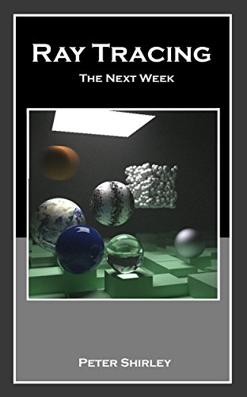

Ray Tracing: The Next Week
====================================================================================================

Getting the Book
-----------------
The _Ray Tracing in One Weekend_ series of books are now available to the public for free in PDF
form, along with the accompanying source code.

You can view the book at https://raytracing.github.io/books/RayTracingTheNextWeek.html. If you would
like a printed or PDF version, print it directly from your browser (it has been styled to support a
printed layout).

Overview
---------
In [Ray Tracing in One Weekend][], you built a simple brute force path tracer. In this installment
we’ll add textures, volumes (like fog), rectangles, instances, lights, and support for lots of
objects using a BVH. When done, you’ll have a “real” ray tracer.

A heuristic in ray tracing that many people -- including me -- believe, is that most optimizations
complicate the code without delivering much speedup. What I will do in this mini-book is go with the
simplest approach in each design decision I make. Check https://in1weekend.blogspot.com/ for
readings and references to a more sophisticated approach. However, I strongly encourage you to do no
premature optimization; if it doesn’t show up high in the execution time profile, it doesn’t need
optimization until all the features are supported!

The two hardest parts of this book are the BVH and the Perlin textures. This is why the title
suggests you take a week rather than a weekend for this endeavor. But you can save those for last if
you want a weekend project. Order is not very important for the concepts presented in this book, and
without BVH and Perlin texture you will still get a Cornell Box!

Corrections & Contributions
----------------------------
If you spot errors, have suggested corrections, or would like to help out with the project, please
review the [CONTRIBUTING][] document for the most effective way to proceed.

Acknowledgments
----------------
Thanks to Becker for his many helpful comments on the draft and to Matthew Heimlich for spotting a
critical motion blur error. Thanks to Andrew Kensler, Thiago Ize, and Ingo Wald for advice on
ray-AABB tests. Thanks to David Hart and Grue Debry for help with a bunch of the details. Thanks to
Jean Buckley for editing.

[CONTRIBUTING]:               ../CONTRIBUTING.md
[directly from GitHub]:       https://github.com/raytracing/raytracing.github.io/releases/
[Hack the Hood]:              http://www.hackthehood.org
[Ray Tracing in One Weekend]: ../InOneWeekend/
[Real-Time Rendering]:        http://www.realtimerendering.com/#books-small-table
[submit issues via GitHub]:   https://github.com/raytracing/raytracing.github.io/issues/
