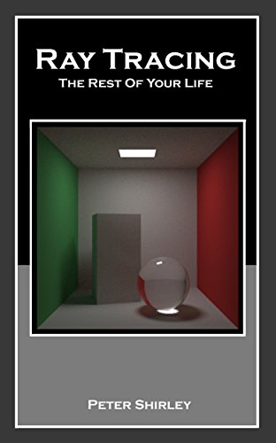

Ray Tracing: The Rest of Your Life
====================================================================================================

Getting the Book
-----------------
The _Ray Tracing in One Weekend_ series of books are now available to the public for free in PDF
form, along with the accompanying source code.

You can view the book at https://raytracing.github.io/books/RayTracingTheRestOfYourLife.html. If you
would like a printed or PDF version, print it directly from your browser (it has been styled to
support a printed layout).

Overview
---------
In [Ray Tracing in One Weekend][] and [Ray Tracing: the Next Week][], you built a “real” ray tracer.

In this volume, I assume you will be pursuing a career related to ray tracing and we will dive into
the math of creating a very serious ray tracer. When you are done you should be ready to start
messing with the many serious commercial ray tracers underlying the movie and product design
industries. There are many many things I do not cover in this short volume; I dive into only one of
many ways to write a Monte Carlo rendering program. I don’t do shadow rays (instead I make rays more
likely to go toward lights), bidirectional methods, Metropolis methods, or photon mapping. What I do
is speak in the language of the field that studies those methods. I think of this book as a deep
exposure that can be your first of many, and it will equip you with some of the concepts, math, and
terms you will need to study the others.

As before, https://in1weekend.blogspot.com/ will have further readings and references.

Corrections & Contributions
----------------------------
If you spot errors, have suggested corrections, or would like to help out with the project, please
review the [CONTRIBUTING][] document for the most effective way to proceed.

Acknowledgements
-----------------
Thanks to Dave Hart and Jean Buckley for help on the original manuscript.

Thanks to Paul Melis, Nakata Daisuke, Filipe Scur, Vahan Sosoyan, and Matthew Heimlich for finding
errors.

Thanks to Tatsuya Ogawa and Aaryaman Vasishta for code improvements.

Thanks to Steve Hollasch, Trevor David Black, Berna Kabadayı and Lorenzo Mancini for translating the
book to Markdeep and moving it to the web.

[CONTRIBUTING]:               ../CONTRIBUTING.md
[directly from GitHub]:       https://github.com/raytracing/raytracing.github.io/releases/
[Hack the Hood]:              http://www.hackthehood.org/
[Ray Tracing in One Weekend]: ../InOneWeekend/
[Ray Tracing: The Next Week]: ../TheNextWeek/
[Real-Time Rendering]:        http://www.realtimerendering.com/#books-small-table
[submit issues via GitHub]:   https://github.com/raytracing/raytracing.github.io/issues/
